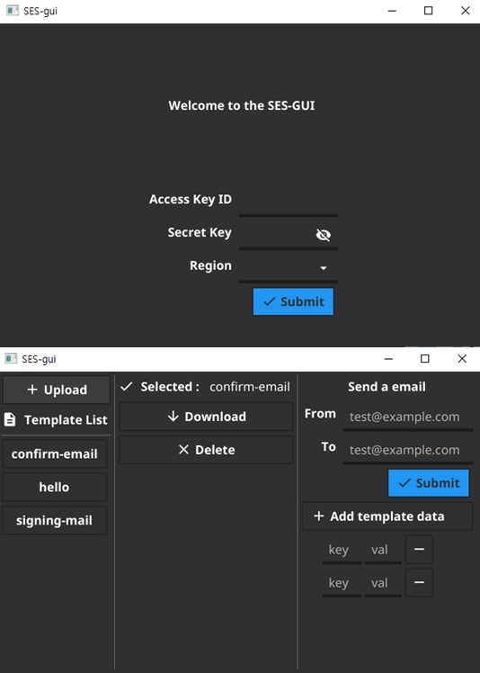

# SES-gui

<p align="left">
  <a href="https://github.com/blackironj/ses-gui/actions"></a>
</p>

This is a GUI tool for uploading, downloading, deleting AWS-SES Email template easily. And also you can test sending email with uploaded template using this tool 

> Currently, AWS-SES does not provide GUI editor yet. So you can use [AWS-CLI](https://awscli.amazonaws.com/v2/documentation/api/latest/index.html) tool to manage email-template instead of this tool. 

## Demo



## Build

> I do not test it on linux and macOS yet.

### Prerequisites

```
golang 1.15+
```

### Windows

```bash
go build -o ses-gui.exe -ldflags="-H windowsgui"
```

## Feature

- [x] Login with an aws access key
- [x] Upload an email template
- [x] Download an email template
- [x] Show list of templates
- [x] Delete a template
- [x] Send an email with selected template

### TODO

- [ ] enhance UI / UX
